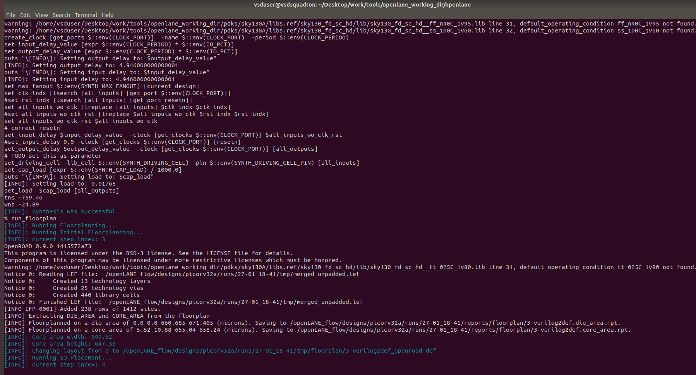
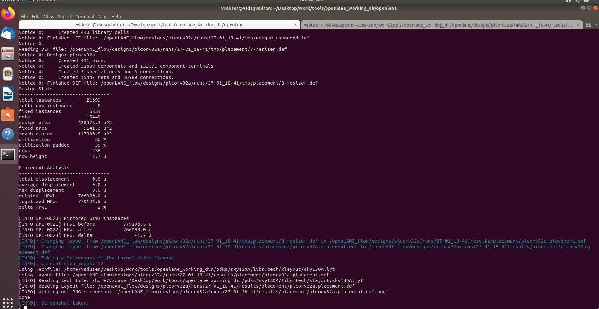

# **DAY - 2**

## Theory:
### 1. Define height and width:
#### A netlist with 2 flops and 2 gates:

If length and breadth were 1 unit, then the area it would occupy is 1 sq units.
If four of them were put together to form a square, the area occupied by netlist would be 4 sq units.

#### Core and die of a Chip

A die which consists of core, is small semiconductor material specimen on which the fundamental circuit is fabricated.

**Utilization factor = (Area Occupied by Netlist)/(Total Area of the Core)**

==> 4 sq units/4 sq units = 1      

**Aspect ratio = height/width**   

*When aspect ratio is 1, it is squared shaped.*

### 2. Define Locations of Preplaced cells:

The arrangement of *MEMORY, CLOCK-GATING CELL, COMPARATOR, MUX* IP's in a chip is referred as **Floor Planning**

These IP's/ blocks have user defined locations, and hence are placed in chip before automated placement-and-routing are are called pre-placed cells

## Running Floor plan screenshot:

After running run_placement

Screenshots of floorplan def in magic

