# **DAY - 4**

## Lab Screenshots:

Creating left file
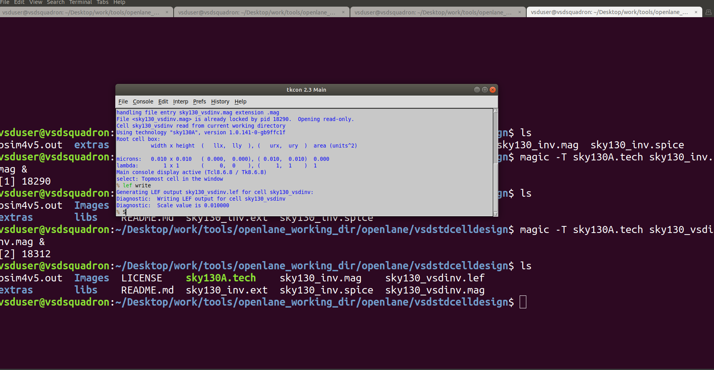
----------------
copying and pasting few files using cp command:
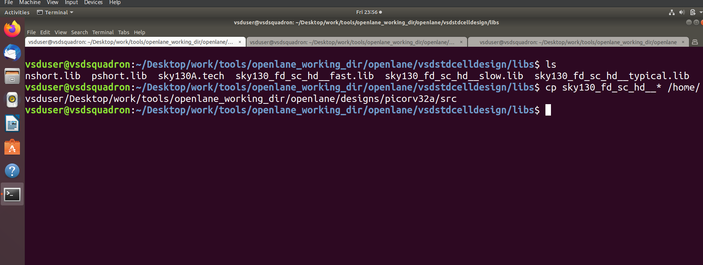
----------------
running `prep -design picorv32a -tag (date)`:
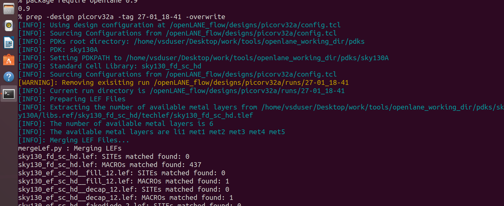
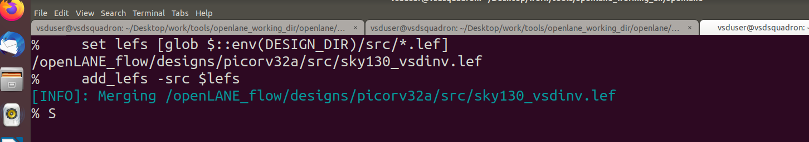
----------------
After running `run_synthesis`:
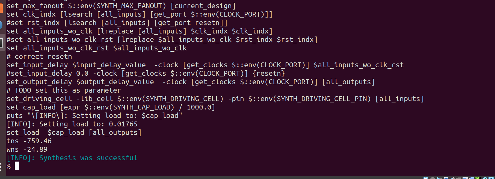
-----------------
After running `run_floorplan`:
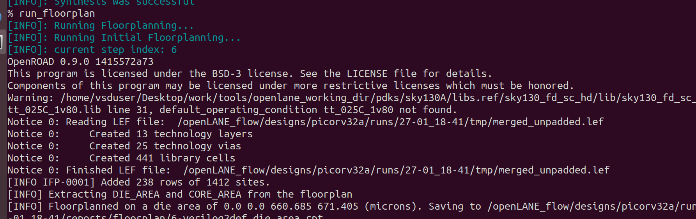
------------------
After running `run_placement`:
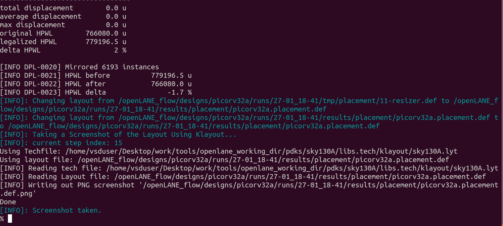
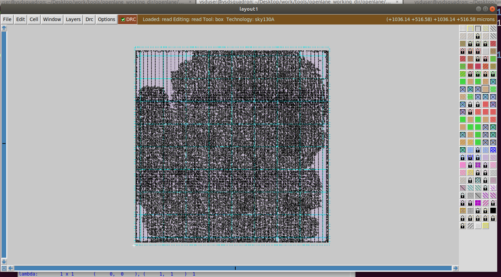
-----------------
Creating a new my_base.sdc file:
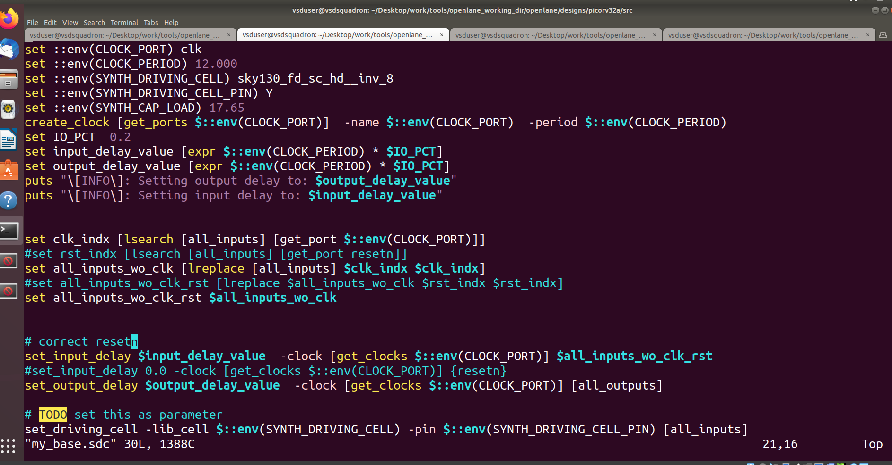
-----------------
Creating a config file:  `pre_sta.conf file`:
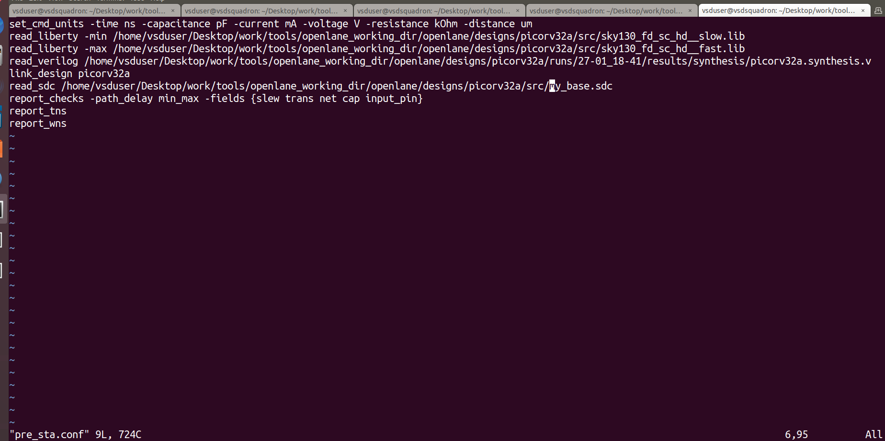
-----------------

Output for  `sta pre_sta.conf`:
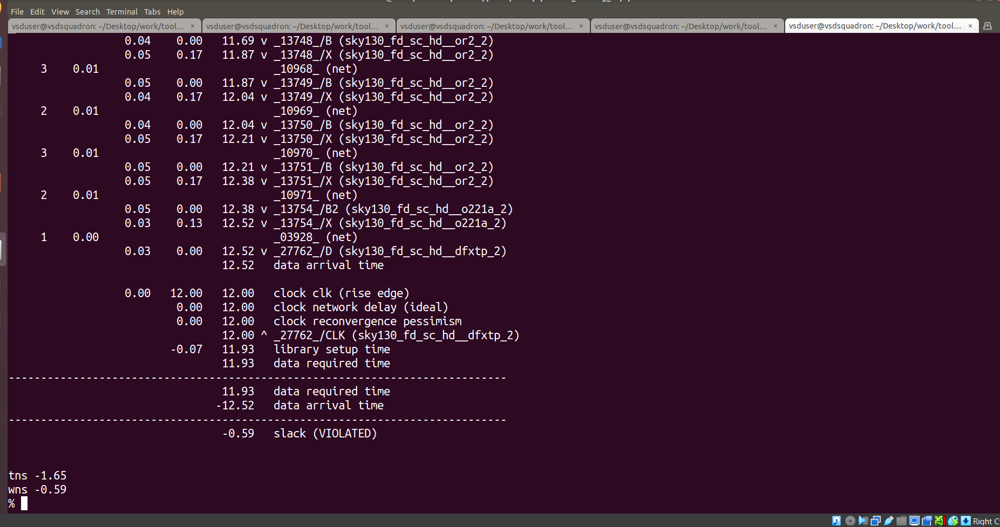
-----------------

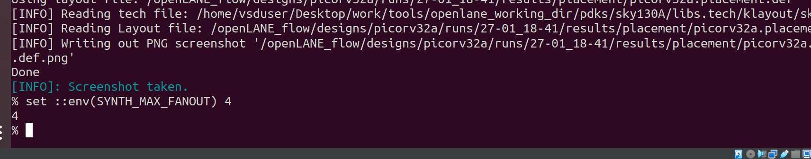

-------------------

Output for  runnning `run_synthesis`:

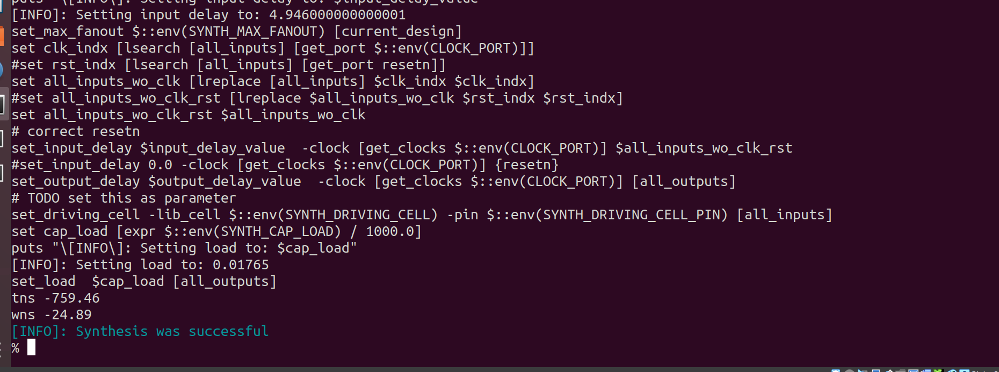

----------------
